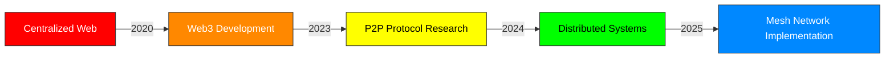

<div align="center">

# FourZeroFour


</div>

---

## About Me

```bash
$ whoami
> fourzerofour

$ cat /etc/interests
> "Distributed systems architect focused on decentralized protocols"
> "Privacy and security enthusiast"
> "Building the next generation of peer-to-peer applications"
```

---

## Current Projects

<div align="center">

| PROJECT | STATUS | DESCRIPTION | TECH |
|---------|--------|-------------|------|
| **Kenshi Online** | `▓▓▓▓▓▓▓░░░` 70% | Multiplayer implementation for single-player games | `C++/ASM` |
| **APA Protocol** | `▓▓▓▓▓▓▓▓▓░` 90% | Advanced packet analysis framework | `C#/WinAPI` |
| **Web4 Nexus** | `▓▓▓▓▓░░░░░` 50% | NAT traversal solution for P2P applications | `Rust/P2P` |
| **YurtCord** | `▓▓▓▓▓▓░░░░` 60% | Decentralized messaging platform | `Go/WebRTC` |
| **Puppeteer** | `▓▓▓▓▓▓▓▓▓▓` 100% | Browser automation for data collection | `JS/Chrome` |

</div>

---

## Technical Skills

```json
{
  "languages": {
    "low_level": ["C++", "C", "Rust", "Assembly", "Fortran", "Ada", "D"],
    "high_level": ["C#", "Go", "Python", "TypeScript", "Java", "Swift", "Kotlin", "Ruby", "PHP", "JavaScript"],
    "scripting": ["Bash", "PowerShell", "Lua", "Perl", "Python", "JavaScript", "Ruby", "Shell"]
  },
  "specializations": {
    "networking": ["TCP/IP", "UDP", "WebRTC", "P2P", "NAT Traversal", "HTTP/HTTPS", "DNS", "MQTT", "gRPC", "GraphQL", "SSL/TLS", "Websockets"],
    "security": ["Packet Analysis", "Reverse Engineering", "Cryptography", "Penetration Testing", "Vulnerability Assessment", "Secure Coding", "Malware Analysis", "Forensics", "Zero Trust"],
    "protocols": ["BitTorrent", "IPFS", "Tor", "Custom P2P", "HTTP/2", "HTTP/3", "WebSockets", "MQTT", "AMQP", "OAuth", "OpenID Connect"],
    "game_dev": ["DLL Integration", "Memory Management", "Network Architecture", "Physics Engines", "Graphics Programming", "AI Systems", "Game Engine Architecture", "Shader Programming"],
    "cloud": ["AWS", "Azure", "GCP", "Kubernetes", "Terraform", "CloudFormation", "Serverless", "Microservices", "Multi-cloud", "IaC"],
    "mobile": ["Android", "iOS", "React Native", "Flutter", "Xamarin", "SwiftUI", "Jetpack Compose", "Cordova"],
    "web": ["React", "Angular", "Vue", "Next.js", "WebAssembly", "PWA", "SPA", "SSR", "JAMstack", "Web3"],
    "database": ["SQL", "NoSQL", "Graph DBs", "Time Series", "Database Design", "PostgreSQL", "MongoDB", "Redis", "Cassandra", "DynamoDB"],
    "ai_ml": ["TensorFlow", "PyTorch", "NLP", "Computer Vision", "Reinforcement Learning", "MLOps", "Feature Engineering", "Neural Networks"]
  },
  "tools": {
    "analysis": ["Wireshark", "IDA Pro", "x64dbg", "Burp Suite", "Ghidra", "Binary Ninja", "Metasploit", "Nmap", "Fiddler", "Radare2"],
    "development": ["VS Code", "Neovim", "GDB", "WinDbg", "Visual Studio", "CLion", "IntelliJ IDEA", "Eclipse", "Git", "GitHub", "GitLab"],
    "virtualization": ["Docker", "QEMU", "VMware", "Proxmox", "Kubernetes", "Vagrant", "VirtualBox", "KVM", "LXC", "Hyper-V"],
    "ci_cd": ["Jenkins", "GitHub Actions", "Travis CI", "CircleCI", "GitLab CI", "ArgoCD", "TeamCity", "Azure DevOps"],
    "monitoring": ["Prometheus", "Grafana", "ELK Stack", "Datadog", "New Relic", "Nagios", "Zabbix", "Splunk", "SolarWinds"],
    "testing": ["JUnit", "Selenium", "Jest", "Cypress", "Pytest", "Postman", "SoapUI", "LoadRunner", "Gatling", "K6"]
  }
}
```

---

## Project Highlights

<details>
<summary><b>Selected Code Samples</b></summary>

### Kenshi Online
```c++
// Implementing multiplayer functionality in a single-player game
class KenshiMultiplayer {
    void IntegrateNetcode() {
        // Hook game loop
        DetourTransactionBegin();
        DetourAttach(&(PVOID&)originalUpdate, HookedUpdate);
        DetourTransactionCommit();
        
        // Synchronize world state
        P2P::BroadcastState(gameState);
    }
};
```

### Web4 Framework
```rust
// Next-generation P2P networking
impl Web4Protocol {
    async fn establish_connection(&self, peer: &PeerId) -> Result<Connection> {
        // NAT traversal implementation
        let connection = self.create_nat_tunnel(peer).await?;
        
        // Set up encryption
        let secure_channel = EncryptedChannel::new(connection);
        
        return Ok(Connection::new(secure_channel))
    }
}
```

### Advanced Packet Analyzer
```csharp
// Network packet inspection tool
public class PacketInspection {
    public PacketData AnalyzeTransportLayer(byte[] packet) {
        // Remove encryption layer
        var processed = ProcessEncryption(packet);
        
        // Analyze protocol details
        return ExtractProtocolData(processed);
    }
}
```

</details>

---

## GitHub Stats

<div align="center">


</div>

---

## Decentralization Roadmap



---

## Contact

<div align="center">

<a href="https://github.com/The404Studios">
  
</a>
<a href="mailto:the404studios@gmail.com">
  
</a>
<a href="https://ko-fi.com/The404Studios">
  
</a>

</div>

---

<div align="center">

</div>
